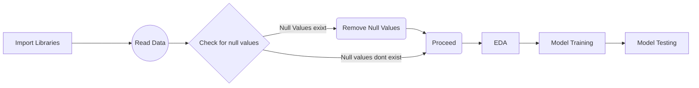

# # Online Fraud Detection

Soon after the great boon in online payments/ digital payments the frauds in the market are increasing day by day. Therefore, so as detect the hogher possibilities of fraud commitency, this project aims at detecting those frauds that are high at risk.


# Working

 This project uses the dataset *"Synthetic Financial Datasets For Fraud Detection"*. It consists of the previous records that has proven to  be potential frauds. The following is the head of data:
 1.  step: represents a unit of time where 1 step equals 1 hour
2.  type: type of online transaction
3.  amount: the amount of the transaction
4.  nameOrig: customer starting the transaction
5.  oldbalanceOrg: balance before the transaction
6.  newbalanceOrig: balance after the transaction
7.  nameDest: recipient of the transaction
8.  oldbalanceDest: initial balance of recipient before the transaction
9.  newbalanceDest: the new balance of recipient after the transaction
10.  isFraud: fraud transaction 

## Distribution of Transaction Types


## Flow of the Project:



## Results

After training the model and running it against  the following models, results have been obtained as:

|    Model Used            |Accuracy Obtained                                                |
|----------------|-------------------------------
|Decision Tree Classifier|`0.997406728674666`            
|Logistic Regression          |`0.9995049209287997`            
|Random Forest Classifier          |`0.9997689631001065`
|Naive Bayes          |`0.994422109131144`

As per the above table it is clear that is winner and gives the best accuracy!!

```
